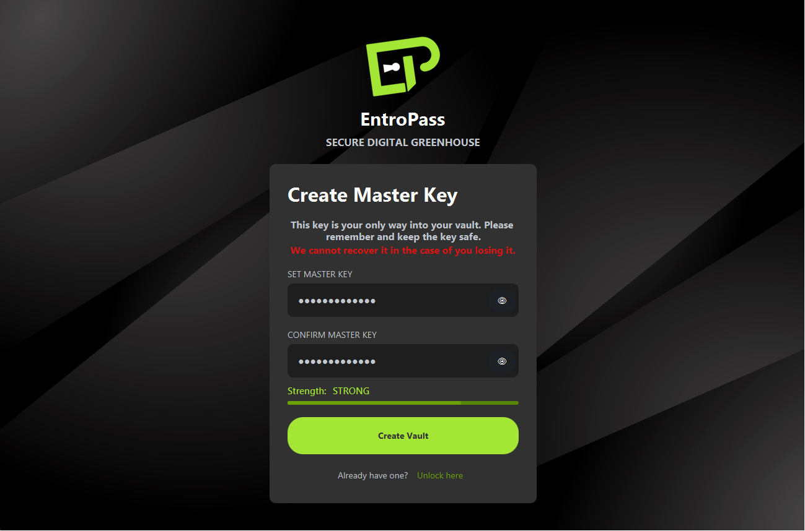
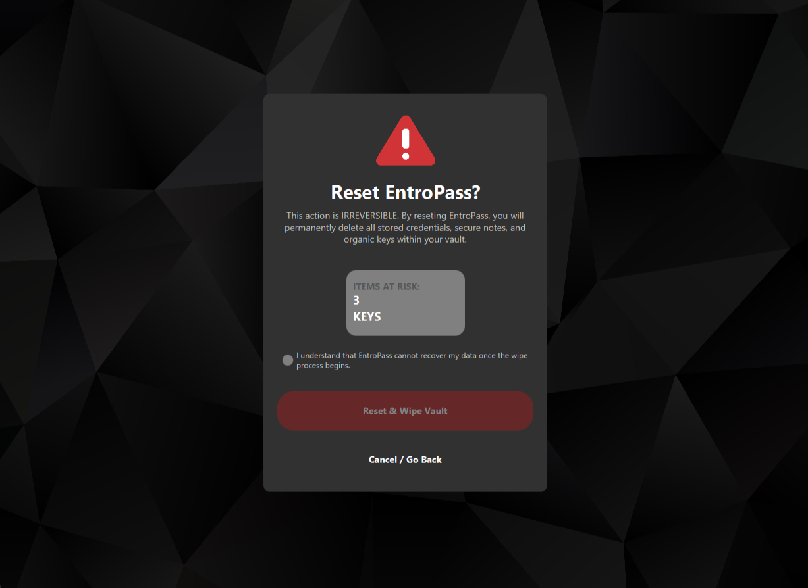
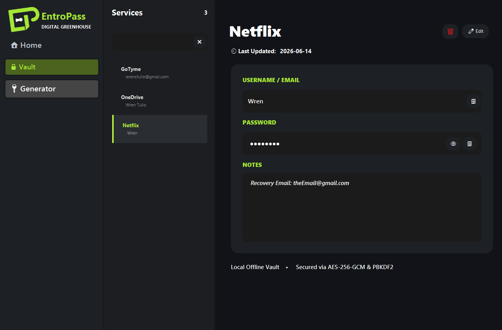
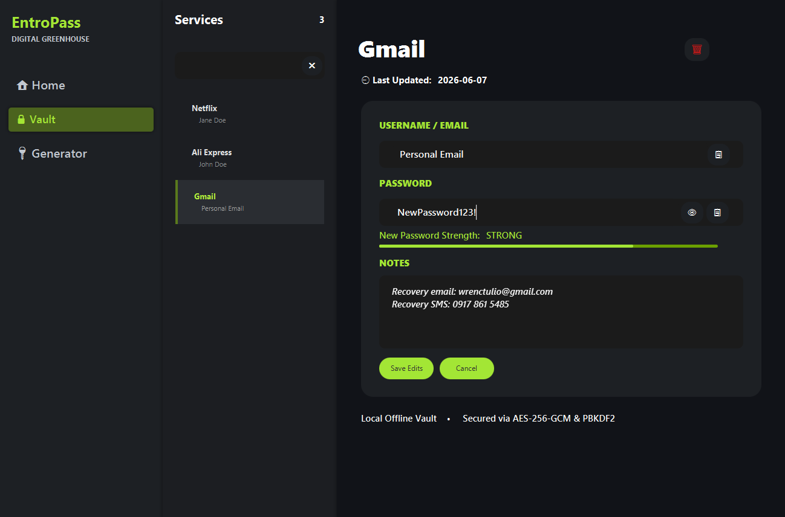
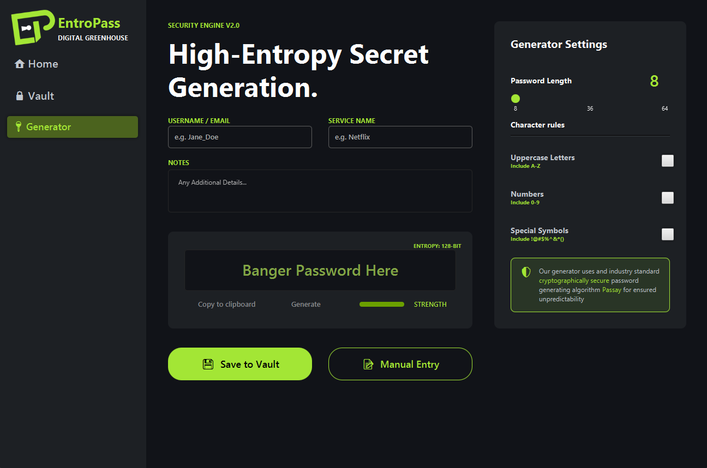
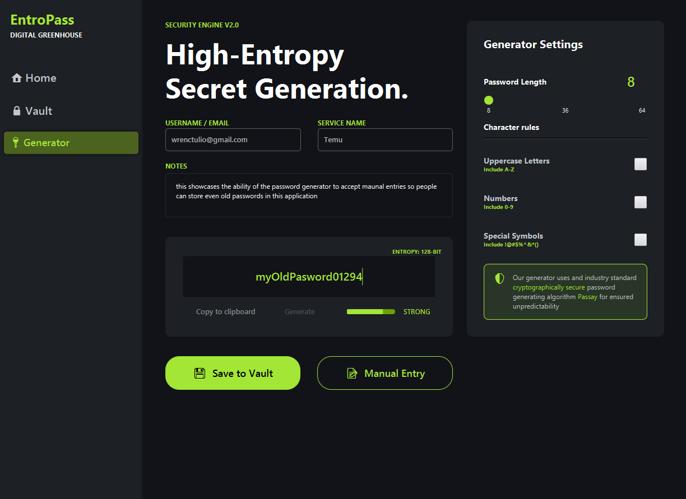

# EntroPass

EntroPass is a JavaFX desktop password manager focused on practical local security: master-password authentication, encrypted vault storage, and a configurable password builder.

This project is designed as a real desktop application, not a demo screen flow. It persists data locally with SQLite, protects vault secrets with authenticated encryption, and gates access through a hashed master credential.

---

## Screenshots

### Login / Registration


*Log in page to gain access to your encrypted assets*


*If you're a new user, you may save a master password that will be your only key for access*


*In the case that a user forgot their master key, they have no choice but to create a new account and lose their encrypted assets.*

### Password Vault


*Easily access your stored password entries*


*As well as easily edit and save changes to your assets*

### Password Builder

*Generate secure unpredictable passwords that can be customized to your needs with the use of <b>Passay</b>*


*Old passwords are still possible to enter and save to our system just by toggling <b>Manual Entry</b>*

---

## Tech Stack

| Layer | Technology |
|---|---|
| Language | Java 21 (LTS) |
| UI | JavaFX 25 (FXML + CSS scene architecture) |
| Build | Maven 3.6+ |
| Database | SQLite (`sqlite-jdbc 3.51.1.0`) |
| Password Hashing | jBCrypt 0.4 (master password) |
| Key Derivation | PBKDF2-HMAC-SHA256 |
| Vault Encryption | AES-GCM (`AES/GCM/NoPadding`) |
| Password Generation | Passay 1.6.6 |

---

## Current Features

### Authentication

- Register and store a master password hash in SQLite
- Login validation against stored BCrypt hash
- Session-based vault access after successful authentication
- First-run routing to registration, returning-user routing to login
- Forgot password flow

### Vault

- Load and display saved vault entries
- Decrypt and view selected entry details
- Search entries by service name or username
- Copy username or password to clipboard
- Edit all fields on existing entries (service name, username, password, notes)
- Delete entries with a confirmation dialog
- Conditional empty-state view when vault has no entries
- Real-time password strength indicators with descriptive labels and progress bars in edit mode
- All sensitive fields (username, password, notes) encrypted with AES-GCM; creation date stored in plaintext

### Password Builder

- Generate passwords with configurable options:
  - Length (8–64)
  - Digits
  - Special characters
  - Mixed-case letters
- Manual entry mode with real-time strength feedback
- Entropy-based strength scoring with labeled progress visualization
- Save generated or manually entered passwords to new vault entries
- Dynamic font size adjustment for long passwords in the preview field

---

## In Progress / Planned
- Continue UI/UX polish and code cleanup from `TODO-list`

---

## Setup and Run

### Prerequisites

- JDK 21+ (LTS)
- Maven 3.6+

### Run Commands

```bash
mvn clean install
mvn javafx:run
```

### Build Note

The project targets Java 21 LTS and uses no preview features, ensuring broad compatibility. The build should compile cleanly with JDK 21 or newer.

If you see version mismatch errors, verify your active JDK:

```bash
java -version
```

---

## Security Design

EntroPass follows a layered local-security model:

1. The master password is **never stored in plaintext**. A BCrypt hash is stored in the `master` table.
2. On successful login, PBKDF2-HMAC-SHA256 derives an AES key from the entered master password plus a stored salt.
3. Vault passwords are encrypted with AES-GCM before writing to SQLite.
4. A fresh IV is generated per encryption operation and prepended to the ciphertext for decryption.
5. Decryption only occurs during an authenticated session using the in-memory session key.

Database file location:

- `${user.home}/EntroPass/PasswordDatabase.sqlite`

Current schema:

```sql
CREATE TABLE IF NOT EXISTS master (
  id   INTEGER PRIMARY KEY CHECK (id = 1),
  hash TEXT NOT NULL,
  salt TEXT NOT NULL
);

CREATE TABLE IF NOT EXISTS vault (
  id                 INTEGER PRIMARY KEY AUTOINCREMENT,
  service_name       TEXT NOT NULL,
  username           TEXT NOT NULL,
  encrypted_password TEXT NOT NULL,
  notes              TEXT,
  created_date       TEXT
);
```

### Known Limitations

**Master password memory residency**
JavaFX's `TextField` returns input as an immutable `String` object before it
can be converted to a `char[]` for zeroing. This means the master password
briefly exists as a plaintext String in the JVM heap during authentication,
with its lifetime controlled by the garbage collector rather than explicitly
wiped. The char array derived from it is zeroed immediately after key
derivation via `Arrays.fill()`, and `PBEKeySpec.clearPassword()` is called
after PBKDF2 derivation. The residual String exposure is a known limitation
of the JavaFX TextField API and represents an acceptable risk for a local
desktop application where physical/remote access to the process memory would
already indicate a compromised machine.
---

## Project Structure

```text
EntroPass/
├── pom.xml
├── README.md
├── TODO-list.md
└── src/
    └── main/
        ├── java/
        │   ├── Database/               # DB manager, DAO classes
        │   ├── Encryption/             # AES-GCM, PBKDF2 key derivation
        │   ├── GUI/
        │   │   ├── Controllers/        # Scene controllers (Auth, SignUp, Builder, Vault, Menu, ForgotPassword)
        │   │   ├── Utils/              # SceneUtils, StrengthUIHelper, vault cell rendering
        │   │   └── Application.java    # JavaFX entry point
        │   ├── org/Password_Generator/ # PasswordBuilder, Configurator, StrengthChecker
        │   └── module-info.java
        └── resources/
            └── org/password_generator_gui/
                ├── Scenes/             # FXML files (7 scenes)
                └── Stylesheets/        # CSS theming
```

---

## License
MIT License — see [LICENSE](LICENSE) for details.
